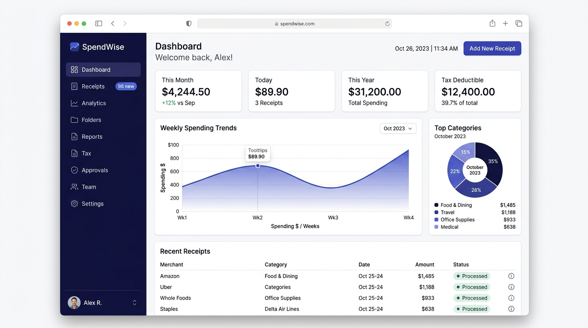

<div align="center">


# Receiptful

### Production-Grade Intelligent Receipt & Expense Management

[](https://nextjs.org/)
[](https://react.dev/)
[](https://www.typescriptlang.org/)
[](https://www.convex.dev/)
[](https://tailwindcss.com/)
[](./LICENSE)

**Receiptful** is a modern, high-performance web and mobile receipt management platform designed to turn paper receipts, PDF invoices, and digital expenses into clean, structured, and tax-ready financial books.

</div>

---

## 📸 Screenshots

### 1. Web Application Dashboard & Command Center
The primary workspace overview providing real-time financial tracking, expense breakdowns, recent uploads, review queues, search filters, and rapid multi-field receipt browsing.

<div align="center">
  
</div>

---

### 2. Mobile Capture & Optical Extraction Engine
Client-side image preprocessing including perspective transformation, automatic deskewing, thermal print contrast enhancement, and instant extraction with field-level confidence indicators.

<div align="center">
  
</div>

---

### 3. Mobile Platform & App Store Distribution
Optimized for cross-platform access with responsive mobile web support, PWA installability, and native mobile packaging.

<div align="center">
  
</div>

---

## 🌟 Key Features

### ⚡ Smart Capture & Client-Side Preprocessing
- **Multi-Source Intake**: Capture receipts via mobile camera, drag-and-drop JPEG/PNG/WebP/HEIC photos, or multi-page PDF documents.
- **Client-Side Image Optimization**: Photos are automatically deskewed, contrast-sharpened for faded thermal receipts, and compressed before upload to minimize bandwidth and latency.
- **Multi-Page Document Stitching**: Seamlessly combine multi-page invoices or keep separate receipts distinct with a single toggle.

### 🔍 Automated Extraction & Confidence Review
- **20+ Structured Fields**: Extracts merchant name, total amount, subtotal, sales tax/VAT, transaction date, payment method, last 4 card digits, invoice number, and itemized line items.
- **Confidence Scoring & Human-in-the-Loop**: Every extracted field receives a confidence score. Low-confidence fields are highlighted with badges so users only review what needs human verification.
- **Duplicate Detection**: Flags transactions sharing identical merchants and amounts within 72 hours to prevent accidental double-claims.

### 🗂️ Tax Treatment & Dynamic Organization
- **14 Preconfigured Tax Categories**: Built-in tax classification with customizable deductibility percentages (100%, 50%, 0%).
- **Keyword Auto-Filing**: Assign merchant keywords to categories so future receipts are automatically filed on upload.
- **Multi-Folder & Tag Grouping**: Organize expenses across fiscal years, client projects, or travel events with flexible multi-folder assignments and custom tags.

### 📊 Multi-Currency Normalization & Budgets
- **Multi-Currency Tracking**: Supports USD, EUR, GBP, INR, AED, CAD, AUD, JPY, SGD, and more with daily automated FX rate updates.
- **Proactive Budget Ceilings**: Set workspace or category-level spending limits with early warning alerts at 80% capacity before overruns occur.

### 👥 Team Collaboration & Role-Based Access Control (RBAC)
- **Granular Roles**: Five distinct workspace roles — `Owner`, `Admin`, `Manager`, `Member`, and `Viewer`.
- **Expense Approval Workflows**: Submit receipts for review, assign reviewers, track approval statuses, and maintain complete audit trails with attached comments.

### 📑 Comprehensive Reporting & Multi-Format Exports
- **Universal Exports**: Download filtered reports in **CSV**, formatted **Excel (.xlsx)** with styled headers and dynamic column widths, or print-ready **PDF**.
- **Tax Prep Summaries**: Instant breakdowns of deductible vs. non-deductible totals, quarterly splits, and identification of missing receipts or unreviewed expenses.

---

## 🛠️ Technology Stack

| Layer | Technology | Purpose |
| :--- | :--- | :--- |
| **Framework** | Next.js 15 (App Router) | High-performance server rendering, streaming, and routing |
| **Frontend** | React 19, TypeScript 5 | Type-safe declarative user interfaces |
| **Backend & Database** | Convex 1.43 | Real-time reactive serverless backend and ACID document store |
| **Authentication** | Convex Auth / Auth.js Core | Secure JWT-based session management and password auth |
| **Styling** | Tailwind CSS 3.4, Radix UI | Accessible component primitives and cohesive design tokens |
| **Icons & Media** | Lucide React | Clean, modern UI iconography |
| **Charts & Analytics** | Recharts | Interactive financial visualization and budget graphs |
| **Export Engine** | SheetJS (xlsx), HTML-to-PDF | Spreadsheet generation and tax-ready PDF compilation |

---

## 📁 Project Structure

```
mobile-receipt-management-app/
├── app/                        # Next.js App Router pages and layouts
│   ├── dashboard/              # Core authenticated application workspace
│   │   ├── analytics/          # Spending analytics and category distribution
│   │   ├── approvals/          # Team expense approval queue
│   │   ├── billing/            # Workspace subscription & plan management
│   │   ├── budgets/            # Budget allocation and threshold monitors
│   │   ├── categories/         # Tax category rules and keyword matchers
│   │   ├── folders/            # Project & fiscal period folder management
│   │   ├── receipts/           # Receipt browser, search, and detail viewer
│   │   ├── reports/            # Export generator (CSV, Excel, PDF)
│   │   ├── settings/           # User preferences and workspace configuration
│   │   ├── tax/                # Tax preparation and deductible spend rollups
│   │   ├── team/               # Team member management and invitations
│   │   ├── trash/              # Soft-deleted receipts with 30-day recovery
│   │   └── welcome/            # First-time user onboarding wizard
│   ├── forgot-password/        # Password reset request and confirmation flow
│   ├── help/                   # Documentation, user guides, and FAQs
│   ├── join/                   # Workspace team invitation acceptance
│   ├── login/                  # Authentication sign-in screen
│   ├── signup/                 # Workspace registration screen
│   ├── globals.css             # Design tokens, variables, and utility classes
│   ├── layout.tsx              # Root layout, metadata, and icon definitions
│   └── page.tsx                # Public marketing landing page
├── components/                 # Reusable UI and domain components
│   ├── app/                    # Navigation shell, command palette, notifications
│   ├── auth/                   # Authentication forms and layouts
│   ├── capture/                # Receipt scanner, image cropper, page editor
│   ├── charts/                 # Analytics charts and budget progress meters
│   ├── common/                 # Page headers, stat cards, loading states
│   ├── marketing/              # Landing page and extraction preview widgets
│   ├── receipts/               # Receipt items, document viewers, metadata editors
│   ├── screens/                # Full screen views for each dashboard section
│   └── ui/                     # Accessible Radix UI design system primitives
├── convex/                     # Reactive serverless backend functions & schema
│   ├── analytics.ts            # Metric aggregation and reporting queries
│   ├── approvals.ts            # Expense approval mutations and workflows
│   ├── auth.ts                 # Convex Auth configuration and handlers
│   ├── budgets.ts              # Budget calculations and threshold alerts
│   ├── categories.ts           # Category management and keyword suggestions
│   ├── crons.ts                # Scheduled daily and quarterly background jobs
│   ├── folders.ts              # Folder indexing and receipts grouping
│   ├── maintenance.ts          # Automated retention, cleanup, and FX rates
│   ├── ocr.ts                  # Receipt extraction and parser integration
│   ├── receipts.ts             # Receipt CRUD, search index, and duplicate checks
│   ├── reports.ts              # Financial report compilers and export queries
│   ├── schema.ts               # Strongly typed database schema & table indexes
│   ├── team.ts                 # Workspace invitations and role assignments
│   └── users.ts                # User profile and workspace context queries
├── hooks/                      # Custom React hooks (haptics, upload, mobile)
├── lib/                        # Shared utilities, formats, and helpers
│   ├── chart-theme.ts          # Recharts color palette and font definitions
│   ├── errors.ts               # Unified error handling and formatting
│   ├── export.ts               # CSV and Excel spreadsheet generators
│   ├── format.ts               # Currency, date, and tax percentage formatters
│   ├── image.ts                # Client-side image cropping and compression
│   └── utils.ts                # Tailwind class variance authority utilities
├── public/                     # Static assets, branding, icons, and screenshots
│   ├── apple-icon.png          # Apple Touch Icon (180x180)
│   ├── favicon.ico             # Standard browser favicon
│   ├── hero-dashboard.jpg      # Web dashboard screenshot
│   ├── hero-mobile.jpg         # Mobile capture screenshot
│   ├── icon-dark-32x32.png     # Dark mode tab icon
│   ├── icon-light-32x32.png    # Light mode tab icon
│   ├── icon.png                # Full-resolution application icon (512x512)
│   ├── icon.svg                # Vector application icon
│   ├── logo.png                # Brand logo (1024x1024)
│   └── playstore.png           # Mobile platform preview
└── package.json                # Project dependencies and deployment scripts
```

---

## 🚀 Getting Started

### Prerequisites
- **Node.js**: Version 18.17.0 or higher
- **Package Manager**: `npm`, `pnpm`, or `yarn`
- **Convex Account**: Free account at [convex.dev](https://www.convex.dev)

### 1. Clone & Install Dependencies
```bash
git clone https://github.com/your-username/receiptful.git
cd receiptful
npm install
```

### 2. Configure Environment Variables
Create a `.env.local` file in the root directory:

```env
# Deployment identifier from Convex
CONVEX_DEPLOYMENT=dev:your-deployment-name

# Public Convex backend endpoints
NEXT_PUBLIC_CONVEX_URL=https://your-deployment-name.convex.cloud
NEXT_PUBLIC_CONVEX_SITE_URL=https://your-deployment-name.convex.site
```

### 3. Start Local Development
Run both the Next.js development server and Convex backend concurrently:

```bash
npm run dev
```

Open [http://localhost:3000](http://localhost:3000) in your browser.

---

## 🧪 Verification & Testing

Execute the automated test suite and verification commands:

```bash
# Typecheck TypeScript codebase
npm run typecheck

# Run unit tests
npm test

# Build production bundle
npm run build

# Run all verification steps in sequence
npm run verify
```

---

## 🚢 Production Deployment

### 1. Deploy Convex Backend
Provision your production Convex deployment:

```bash
npx convex deploy
```

### 2. Configure Production Auth & Keys
Convex Auth uses RS256 JWT keypairs. Generate and set the production auth keys:

```bash
node -e '
const { generateKeyPair, exportPKCS8, exportJWK } = require("jose");
generateKeyPair("RS256", { extractable: true }).then(async ({ privateKey, publicKey }) => {
  const { execFileSync } = require("child_process");
  const jwks = JSON.stringify({ keys: [{ use: "sig", ...(await exportJWK(publicKey)) }] });
  execFileSync("npx", ["convex", "env", "set", "--prod", "JWT_PRIVATE_KEY", "--", await exportPKCS8(privateKey)], { stdio: "inherit" });
  execFileSync("npx", ["convex", "env", "set", "--prod", "JWKS", "--", jwks], { stdio: "inherit" });
});'

# Set production application origin
npx convex env set --prod SITE_URL https://your-production-domain.com

# (Optional) Set OCR extraction key for automated parsing
npx convex env set --prod ANTHROPIC_API_KEY sk-ant-...

# (Optional) Set transactional email keys for password resets
npx convex env set --prod AUTH_RESEND_KEY re_...
npx convex env set --prod AUTH_EMAIL_FROM "Receiptful <noreply@your-domain.com>"
```

### 3. Deploy Frontend
Set the following environment variables in your hosting provider (Vercel, AWS Amplify, Netlify, or Docker):

- `CONVEX_DEPLOY_KEY`: Obtained from Convex Dashboard → Settings → Deploy Keys
- `NEXT_PUBLIC_CONVEX_URL`: Production Convex URL

Deploy using the unified command:
```bash
npx convex deploy --cmd 'npm run build'
```

---

## ⏰ Automated Scheduled Jobs

Receiptful runs automated maintenance tasks via Convex Crons (`convex/crons.ts`):

| Scheduled Task | Frequency | Function |
| :--- | :--- | :--- |
| **Budget Alerts** | Daily at 07:00 UTC | Analyzes workspace spending and alerts managers when thresholds exceed 80% |
| **Trash Purge** | Daily at 03:00 UTC | Permanently removes soft-deleted receipts past their 30-day recovery window |
| **Invite Expiry** | Daily at 03:30 UTC | Invalidates pending workspace invitations older than 60 days |
| **Auto-Archive** | Daily at 04:00 UTC | Archives closed-period receipts based on workspace retention policy |
| **Account Deletion** | Daily at 04:30 UTC | Completes user account deletion requests after 30-day grace period |
| **Exchange Rates** | Daily at 05:00 UTC | Synchronizes daily foreign exchange rates for accurate multi-currency totals |
| **Tax Reminders** | Quarterly (Jan/Apr/Jul/Oct) | Notifies workspace owners of unreviewed deductible receipts before tax deadlines |

---

## 🔒 Security & Privacy

- **Data Ownership**: Receipts are strictly isolated per workspace. Server functions authenticate user sessions and verify role permissions on every query and mutation.
- **Zero Training Retention**: Document images and OCR outputs are never used for machine learning model training.
- **Data Portability**: Complete workspace data can be exported at any time in standard JSON, CSV, and Excel formats.
- **Audit Trails**: Full timestamped revision history on approvals, status transitions, and receipt edits.

---

## 📄 License

This project is licensed under the [MIT License](./LICENSE).
