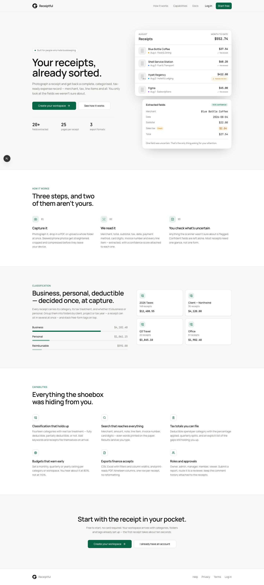
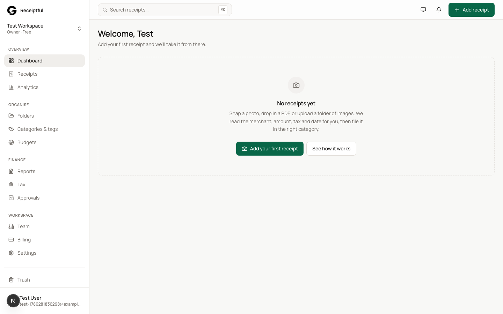
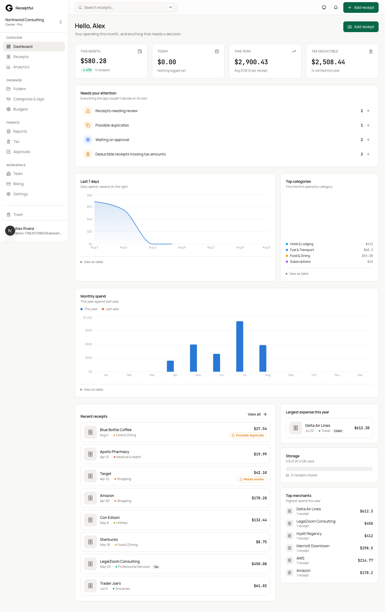
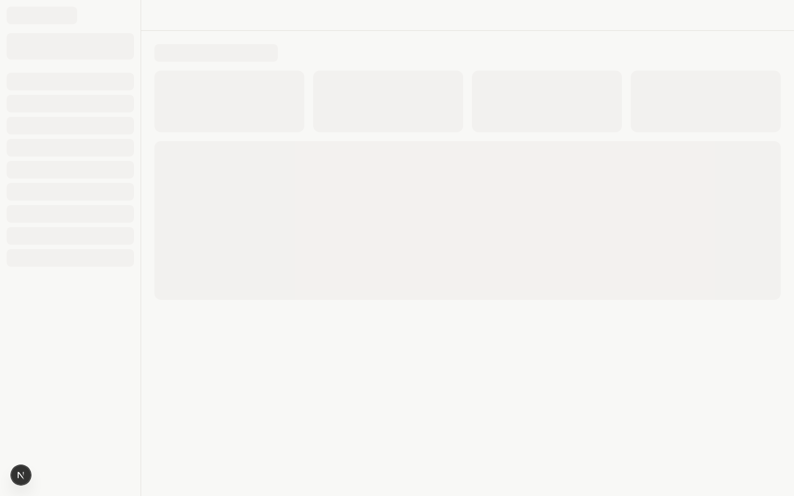
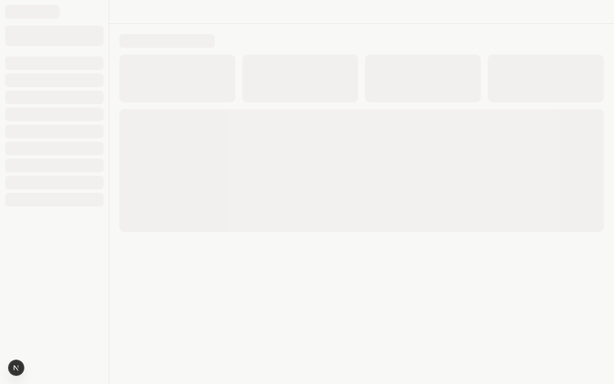
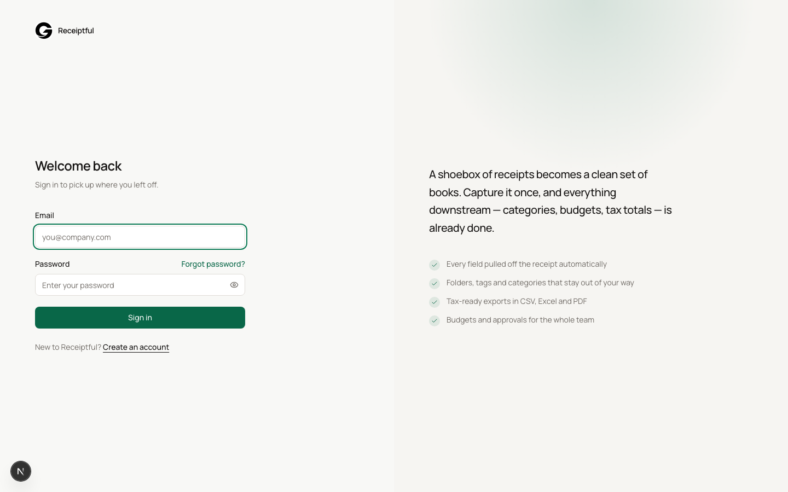
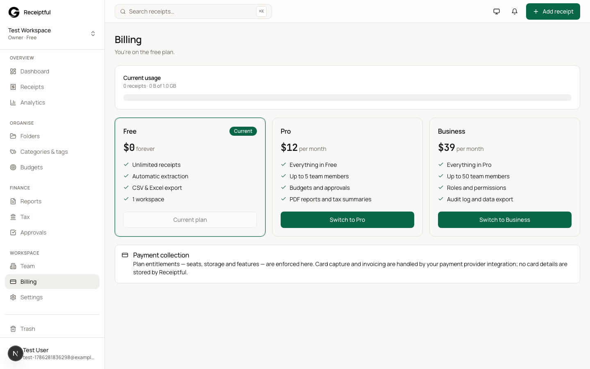
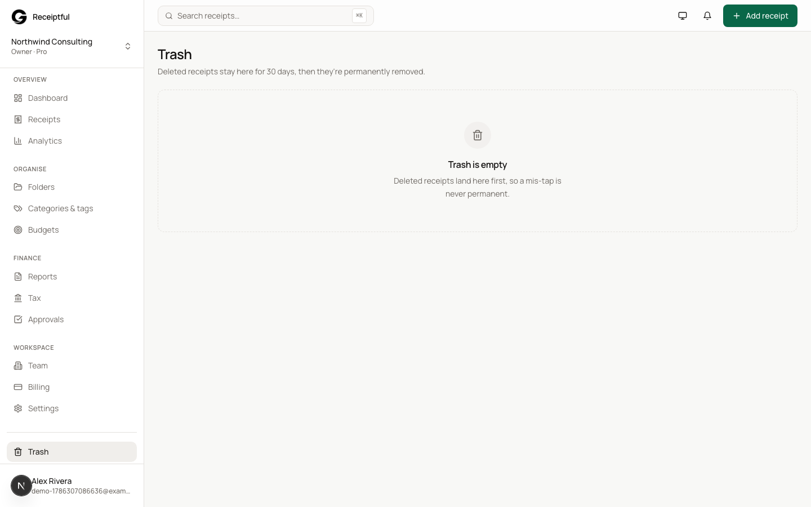
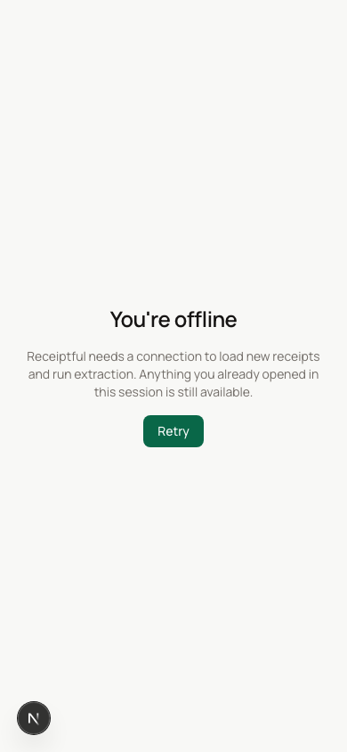

<p align="center">
  
</p>
<h1 align="center">Receiptful</h1>
<p align="center">
  Capture paper receipts, PDF invoices and digital expenses, extract every field
  automatically, organise them into folders and tags, and export tax-ready
  reports — from the desk or from a phone.
</p>
<p align="center">
  Built with Next.js 15 (App Router), Convex and Tailwind CSS.
</p>

## Features

**Capture & extraction**
- **Multi-source intake** — mobile camera, drag-and-drop JPEG/PNG/WebP/HEIC photos, or multi-page PDF documents.
- **Client-side preprocessing** — deskew, contrast sharpen for faded thermal prints, and compress before upload.
- **Multi-page document stitching** — combine multi-page invoices or keep them separate, with a single toggle.
- **20+ structured fields** — merchant, totals, sales tax, date, payment method, last 4 card digits, invoice and receipt numbers, line items.
- **Verified extraction** — every extracted field carries a confidence score, and the results are then cross-checked deterministically (subtotal + tax + tip against the total, line items against the total, dates against today, currency against the supported list). Anything that fails a check is routed to human review no matter how confident the model claimed to be.
- **Duplicate detection** — flags matching merchant and amount within three days of the receipt date to prevent accidental double-claims.

**Organisation**
- **14 preconfigured tax categories** — 100% / 50% / 0% deductibility built in.
- **Keyword auto-filing** — assign merchant keywords to categories so future receipts are filed automatically on upload.
- **Multi-folder & tag grouping** — organise across fiscal years, client projects, or travel events with multi-folder assignments and custom tags.
- **Saved filters** — every search can be saved and shared with the rest of the workspace.

**Money, currency & budgets**
- **Multi-currency tracking** — 20 currencies including zero-decimal ones like JPY, converted at capture time against a daily FX snapshot. The rate used is stored on the receipt, so a later refresh never rewrites past totals.
- **Proactive budget ceilings** — workspace or category-level spending limits with alerts at 80% before overruns.
- **Workspace rollups** — every receipt is converted to the workspace base currency at capture time so totals stay consistent.

**Team & approvals**
- **Five workspace roles** — Owner, Admin, Manager, Member, Viewer.
- **Expense approval workflows** — submit a report or a single receipt, assign a reviewer (only they or an admin can decide it), track status, attach comments. Receipts lock while under review so an approved total cannot drift, and withdrawing preserves the trail rather than deleting it.
- **Team invitations** — tokenised join links, role-bound, with automatic expiry. Links are generated for an admin to share; the app does not send invitation email.

**Reporting & exports**
- **Universal exports** — CSV, formatted Excel (.xlsx) with styled headers, and print-ready PDF.
- **Tax prep summaries** — deductible vs. non-deductible totals, quarterly splits, missing-receipt and unreviewed-expense flags.

**Mobile & offline**
- **PWA installable** — manifest, service worker, splash and shortcuts; install to home screen on iOS and Android.
- **Offline shell** — a typed `/offline` fallback when the network is gone. Authenticated pages are deliberately never cached, so nothing of one user's session can be served to another on a shared device.
- **Responsive layout** — every dashboard surface is touch-first, including the page editor, rotate and retake flows.

**Money**
- **Integer minor units everywhere** — one parser (`lib/money.ts`) shared by the browser and the backend, so a thousands separator can never be read as a decimal point and JPY is never inflated 100x.
- **Fiscal years** — a workspace on an April or July year start gets tax totals and quarters aligned to its own year, not the calendar.

**Production hardening (no third-party services required)**
- **Security headers** — HSTS, CSP, X-Frame-Options, Referrer-Policy, Permissions-Policy.
- **Login attempt throttle** — Convex-backed counter that warns at 3 failures and adds a short cooldown at 6. This is a UX throttle and an audit signal, not an access control: it is advanced by the client, so it does not stop an attacker calling the auth endpoint directly. It deliberately does not lock accounts, because a public counter that can disable an account is a denial-of-service vector.
- **Password complexity** — 8+ chars with upper/lower/digit, enforced at sign-up.
- **Health endpoint** — `GET /api/health` liveness probe for container orchestrators and uptime checks.
- **Sitemap & robots** — public surface only, auth and API excluded.
- **Scoped CSP** — `connect-src` is pinned to the deployment's own Convex origin rather than a wildcard over every Convex project.
- **Billing is off by default** — plan upgrades grant real entitlements, so self-serve upgrades require `BILLING_SELF_SERVE=1`. Without a payment provider wired up, a deployment cannot give away a paid plan.
- **CI** — typecheck, unit tests and production build run on every PR. Tests cover the money, currency, fiscal-year, keyword and extraction-validation logic, including a regression test for every money bug fixed to date.

## Screenshots

Captured against a seeded workspace so every surface shows real-looking data instead of empty states. Ordered to match the path a new user takes through the app.

**1. Landing**


**2. Sign up**


**3. Sign in**


**4. Welcome**


**5. Dashboard home**


**6. Receipts browser**


**7. Receipt detail**


**8. Categories**


**9. Folders**


**10. Budgets**


**11. Analytics**


**12. Tax summary**


**13. Reports**


**14. Approvals**


**15. Team**


**16. Billing**


**17. Settings**


**18. Trash**


**19. Offline shell**


PWA install (the iOS/Android "Add to Home Screen" share-sheet prompt) is a device-native OS surface, not an in-app screen, so it isn't captured here.

Re-capture all of the above after a UI change with [`scripts/capture-screenshots.mjs`](scripts/capture-screenshots.mjs): it signs up a fresh account, seeds it with realistic receipts, budgets, reports and a small team, and screenshots every surface with Playwright.

```bash
npm install --save-dev playwright && npx playwright install chromium
npx convex dev            # one terminal
npm run dev:web           # another terminal
node scripts/capture-screenshots.mjs
```

## Requirements

- Node.js 20+ (pinned in `.nvmrc`)
- A Convex account — free at [convex.dev](https://www.convex.dev)
- (Optional) An Anthropic API key for automatic OCR. Without it, every receipt lands in the review queue with a clear "enter manually" notice; the rest of the app works unchanged.
- (Optional) A Resend API key for the password-reset email flow. Without it, the forgot-password page says so plainly instead of pretending to send.

## Installation & setup

Clone the repository and install dependencies:

```bash
git clone https://github.com/your-username/receiptful.git
cd receiptful
npm install
```

Copy the environment template and fill in the values:

```bash
cp .env.example .env.local
```

The required values are:

- `NEXT_PUBLIC_CONVEX_URL` — the public Convex deployment URL.
- `SITE_URL` — the public origin of the web app, used to drive auth redirects and password-reset email links.

Then provision the Convex deployment and run the app:

```bash
npx convex dev     # in one terminal — provisions the backend
npm run dev        # in another — runs the Next.js dev server
```

Open [http://localhost:3000](http://localhost:3000). The first visit to `/signup` creates the owner account and a personal workspace. After that, staff and members are invited from **Settings → Team**.

## End-to-end user journey

The screenshots above are ordered to match the path a real user takes on first run. Each step lists the URL and the actions the user takes.

1. **Land on the marketing page** — `/` explains the value prop, shows a live receipt-preview widget, and offers `Sign in` / `Create account`.
2. **Create an account** — `/signup` asks for name, work email, optional workspace name, and a password. The password strength meter live-checks the three rules. On submit, a Convex `users` row is created and a personal workspace is provisioned (14 categories, 3 folders, 5 tags) via [bootstrap](convex/model/bootstrap.ts).
3. **Run the welcome wizard** — `/dashboard/welcome` lets the user confirm the workspace name, base currency, fiscal year start, and tax label. The first run is detected via `onboardingCompleted` on the user row.
4. **Capture a receipt** — `/dashboard/receipts?capture=1` opens the mobile capture provider: live camera on phone, drag-and-drop on desktop. Pages are client-side preprocessed (deskew, contrast) and uploaded to Convex storage with a thumbnail.
5. **Wait for extraction** — if `ANTHROPIC_API_KEY` is set, the `processReceipt` action in [ocr.ts](convex/ocr.ts) reads the image with Claude, writes 20+ fields with per-field confidence scores, and routes low-confidence ones to the review queue. If not, the receipt goes straight to `needs_review` with a clear notice.
6. **Review and edit** — `/dashboard/receipts/[id]` lets the user confirm fields, fix anything flagged as low confidence, change the category, add tags, drop it into a folder, and write a note. Every edit writes a row to `receiptVersions`.
7. **Browse the library** — `/dashboard/receipts` is the searchable, filterable, sortable index. Filters by date range, category, status, amount, merchant, and tag combine; every search can be saved and shared.
8. **Watch the dashboards update** — `/dashboard` shows running totals, the review queue, top categories, and a recent-uploads feed, all live from Convex. `/dashboard/analytics` adds the trend charts.
9. **Run approvals** — `/dashboard/approvals` is the team's review queue. Managers approve, return, or reject with a comment. Each decision lands in the audit trail.
10. **File a tax report** — `/dashboard/tax` shows deductible vs. non-deductible totals by quarter. **Settings → Reports → Export** writes CSV, styled Excel, or print-ready PDF.
11. **Install as a PWA** — on iOS and Android, the browser offers "Add to Home Screen" once the manifest is detected. The service worker caches the shell and serves `/offline` when there is no network.
12. **Recover from a deletion** — `/dashboard/trash` holds every soft-deleted receipt for 30 days. The `trash-purge` cron in [crons.ts](convex/crons.ts) removes anything past the window.

The full surface map is:

| Surface | Route | Notes |
| --- | --- | --- |
| Landing | `/` | Public marketing |
| Sign in | `/login` | Rate-limited, see [rateLimits.ts](convex/rateLimits.ts) |
| Sign up | `/signup` | Creates the owner + a personal workspace |
| Forgot password | `/forgot-password` | Email delivery only when `AUTH_RESEND_KEY` is set |
| Help | `/help` | Searchable user guide |
| Join workspace | `/join/[token]` | Tokenised invitation acceptance |
| Offline shell | `/offline` | Service-worker fallback |
| Dashboard home | `/dashboard` | Live KPIs + review queue |
| Welcome | `/dashboard/welcome` | First-run wizard |
| Receipts browser | `/dashboard/receipts` | Search, filter, save filters |
| Receipt detail | `/dashboard/receipts/[id]` | Edit, comment, audit |
| Folders | `/dashboard/folders[/id]` | Nested grouping |
| Categories | `/dashboard/categories` | Tax rules + keyword matchers |
| Budgets | `/dashboard/budgets` | Workspace and category ceilings |
| Tax summary | `/dashboard/tax` | Deductible rollups |
| Reports | `/dashboard/reports[/id]` | Exports in CSV/Excel/PDF |
| Approvals | `/dashboard/approvals[/id]` | Manager review queue |
| Team | `/dashboard/team` | Members + invites |
| Billing | `/dashboard/billing` | Plan and seat management |
| Settings | `/dashboard/settings` | User preferences |
| Trash | `/dashboard/trash` | 30-day recovery |
| Analytics | `/dashboard/analytics` | Trend and category charts |

## Roles

| Role | Access |
| --- | --- |
| Owner | Everything, including billing, deleting the workspace, and removing members |
| Admin | All workspace data, settings, team, and approvals |
| Manager | Receipts, approvals, budgets, reports, read-only settings |
| Member | Create and edit own receipts, submit for approval |
| Viewer | Read-only across the workspace |

## Project structure

```
receiptful/
├── app/                                # Next.js App Router
│   ├── dashboard/                      # Authenticated workspace
│   │   ├── analytics/                  # Trend charts
│   │   ├── approvals/[id]/             # Approval queue + decision view
│   │   ├── billing/                    # Plan & seats
│   │   ├── budgets/                    # Budget ceilings
│   │   ├── categories/                 # Tax categories & keyword matchers
│   │   ├── folders/[id]/               # Folder hierarchy
│   │   ├── receipts/[id]/              # Receipt browser + detail
│   │   ├── reports/[id]/               # Generated reports + exports
│   │   ├── settings/                   # User preferences
│   │   ├── tax/                        # Deductible rollups
│   │   ├── team/                       # Members & invitations
│   │   ├── trash/                      # 30-day recovery
│   │   └── welcome/                    # First-run wizard
│   ├── api/health/                     # Liveness probe
│   ├── forgot-password/                # Password reset request & confirm
│   ├── help/                           # User guide
│   ├── join/[token]/                   # Invitation acceptance
│   ├── login/                          # Sign in
│   ├── offline/                        # Service-worker shell
│   ├── signup/                         # Create account
│   ├── robots.ts                       # robots.txt (auth + API excluded)
│   ├── sitemap.ts                      # sitemap.xml (public surface only)
│   ├── layout.tsx                      # Root metadata, fonts, PWA registration
│   └── page.tsx                        # Public marketing landing
├── components/
│   ├── app/                            # Shell, command palette, notifications
│   ├── auth/                           # Forms for sign in / sign up / reset / join
│   ├── capture/                        # Camera, page editor, multi-page stitching
│   ├── charts/                         # Chart primitives (Recharts wrappers)
│   ├── common/                         # Headers, stat cards, empty states
│   ├── marketing/                      # Landing, receipt preview
│   ├── receipts/                       # Receipt item, document viewer
│   ├── screens/                        # Full screens for each dashboard surface
│   └── ui/                             # Radix-based design system primitives
├── convex/                             # Reactive serverless backend
│   ├── model/                          # Shared helpers (lib, defaults, guards, email)
│   ├── _generated/                     # Convex codegen output
│   ├── analytics.ts                    # Metric queries
│   ├── approvals.ts                    # Approval workflow
│   ├── auth.ts                         # Convex Auth configuration
│   ├── auth.config.ts                  # Provider config
│   ├── budgets.ts                      # Budget calculations + alerts
│   ├── categories.ts                   # Category management
│   ├── crons.ts                        # Scheduled jobs
│   ├── folders.ts                      # Folder CRUD
│   ├── http.ts                         # HTTP routes (Convex HTTP actions)
│   ├── maintenance.ts                  # Retention, FX sync, account deletion
│   ├── notifications.ts                # In-app notifications
│   ├── ocr.ts                          # Claude vision extraction
│   ├── ocrStore.ts                     # OCR result storage
│   ├── rateLimits.ts                   # Login attempt counter
│   ├── receipts.ts                     # Receipt CRUD + duplicate detection
│   ├── reports.ts                      # Report compilation
│   ├── savedFilters.ts                 # Saved search views
│   ├── schema.ts                       # Convex database schema
│   ├── tags.ts                         # Tag CRUD
│   ├── team.ts                         # Workspace invitations
│   ├── uploads.ts                      # Upload URL, page attach, rotate, retake
│   ├── users.ts                        # User profile queries
│   └── workspaces.ts                   # Workspace CRUD
├── hooks/                              # use-haptics, use-mobile, use-receipt-upload
├── lib/                                # chart-theme, errors, export, format, image, log, utils
├── public/                             # Static assets + screenshots
├── styles/                             # globals.css
├── .github/workflows/ci.yml            # typecheck → test → build on every PR
├── .env.example                        # Required + optional env vars
├── .nvmrc                              # Node 20.x
├── middleware.ts                       # Auth-aware route guard
└── package.json
```

## Checks

```bash
npm run typecheck && npm test && npm run build
```

- `npm run typecheck` — TypeScript in noEmit mode across `app/`, `components/`, `convex/`, and `hooks/`.
- `npm test` — the [lib unit tests](convex/model/lib.test.ts) cover money parsing, date validity, merchant normalisation, OCR confidence routing, category suggestion, search-text capping, and rate-limit thresholds.
- `npm run build` — Next.js production build. Writes the `.next/` bundle and renders every route.

CI runs the same three commands on every push and pull request via [`.github/workflows/ci.yml`](.github/workflows/ci.yml).

## Deployment

Build and start a production server:

```bash
npm run build
npm start
```

The full step-by-step runbook lives in [DEPLOYMENT.md](DEPLOYMENT.md). The short version:

```bash
# 1. Provision the production Convex deployment
npx convex deploy

# 2. Generate the auth keypair and pin the prod origin
node -e '
const { generateKeyPair, exportPKCS8, exportJWK } = require("jose");
generateKeyPair("RS256", { extractable: true }).then(async ({ privateKey, publicKey }) => {
  const { execFileSync } = require("child_process");
  const jwks = JSON.stringify({ keys: [{ use: "sig", ...(await exportJWK(publicKey)) }] });
  execFileSync("npx", ["convex", "env", "set", "--prod", "JWT_PRIVATE_KEY", "--", await exportPKCS8(privateKey)], { stdio: "inherit" });
  execFileSync("npx", ["convex", "env", "set", "--prod", "JWKS", "--", jwks], { stdio: "inherit" });
});'
npx convex env set --prod SITE_URL https://your-domain.com

# 3. (Optional) Turn on automatic OCR + password-reset email
npx convex env set --prod ANTHROPIC_API_KEY sk-ant-...
npx convex env set --prod AUTH_RESEND_KEY re_...
npx convex env set --prod AUTH_EMAIL_FROM "Receiptful <noreply@your-domain.com>"

# 4. Deploy the backend and the frontend in one step
npx convex deploy --cmd 'npm run build'
```

Frontend-only env vars (`NEXT_PUBLIC_*`, `CONVEX_DEPLOY_KEY`) are set on the host (Vercel, Netlify, AWS Amplify, Docker).

**Vercel**

1. Import the repository into Vercel.
2. Add `CONVEX_DEPLOY_KEY` and `NEXT_PUBLIC_CONVEX_URL` under Project Settings → Environment Variables.
3. Vercel runs `npm run build` automatically; the Convex build step is driven by the same command above.

**Docker / self-hosted**

```bash
npm ci
npm run build
NODE_ENV=production \
  NEXT_PUBLIC_CONVEX_URL=https://your-deployment.convex.cloud \
  npm start
```

The app listens on port 3000 by default; put it behind a reverse proxy (Nginx, Caddy, or your platform's load balancer) for TLS.

## Design notes

- **Money is stored as integer minor units (cents)** and only converted for display, so totals never drift. Every parse path — the OCR response, the export writer, the budget calculator, the test suite — funnels through the same parser in [lib.ts](convex/model/lib.ts).
- **All workspace-scoped tables carry `workspaceId` as the first index field** so row-level authorisation is a single index lookup. The [guards](convex/model/guards.ts) module checks it on every query and mutation.
- **Multi-currency normalisation** runs at capture time: the receipt's amount is converted to the workspace base currency using the daily FX snapshot in `exchangeRates`, and both numbers are stored so the original is never lost.
- **Sessions are JWTs in an httpOnly cookie.** [middleware.ts](middleware.ts) verifies the signature and routes by role before any HTML is produced; every server function then re-checks the live session, so a deactivated user or a stale token is rejected even with a valid cookie.
- **Sign-in is rate-limited per identifier (lower-cased email)** with a soft warn at 3 failures and a hard lockout at 6 for 15 minutes. Successful sign-in clears the counter; a stale lockout expires automatically. See [rateLimits.ts](convex/rateLimits.ts).
- **OCR is graceful.** When `ANTHROPIC_API_KEY` is missing or the upstream call fails, the receipt is routed to the review queue with a clear "enter the details manually" notice — the product never silently breaks.
- **Soft delete + 30-day recovery.** Deleting a receipt sets `deletedAt`; the [trash-purge cron](convex/crons.ts) removes anything past 30 days. The `trash` screen is the only place deleted rows are visible.
- **Audit trails are first-class.** Every approval decision, status change, and field edit writes a row to `auditLogs` or `receiptVersions` so workspace owners can reconstruct any change.
- **Security headers are unconditional.** HSTS, CSP, X-Frame-Options, Referrer-Policy and Permissions-Policy are set in [next.config.mjs](next.config.mjs) on every route. The CSP locks down `connect-src` to Convex origins and `frame-ancestors` to `'none'`.
- **PWA is installable but cache-safe.** The service worker caches navigations and same-origin static assets, and never caches Convex traffic — every API call is authenticated and data-live, so a stale response would be worse than an error.

## License

[MIT](LICENSE)
